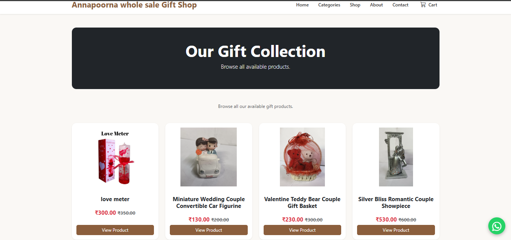

<p align="center">
  
</p>

# 🎁 Annapoorna Wholesale Gift Shop

<p align="center">


</p>

A modern **ASP.NET Core MVC-based wholesale gift shop management and customer reservation website** developed for **Annapoorna Wholesale Gift Shop**.

The application provides a complete digital shopping experience where customers can browse products, view product details, add products to their cart, provide their details, reserve selected products, and receive a unique **token number** for visiting the physical shop and completing their purchase.

The system also provides a dedicated **Admin Panel** for managing products, categories, brands, banners, customer reservations, orders, contact messages, and website settings.

---

# 🏪 About the Project

**Annapoorna Wholesale Gift Shop** is a traditional gift shop platform designed to provide customers with a convenient way to explore products online before visiting the physical store.

The website combines a modern online product browsing experience with a traditional **visit-and-buy** shopping model.

Customers can:

* Browse products online
* View product details
* Add products to the cart
* Enter their contact details
* Reserve selected products
* Receive a unique token number
* Visit the physical shop
* Show their reservation token
* Verify their reservation
* Pay at the shop
* Complete their purchase

The system is designed to simplify the reservation process for both customers and shop administrators.

---

# 🎯 Project Objective

The main objective of this project is to provide a simple, modern, and user-friendly digital platform for a traditional wholesale gift shop.

The system helps:

* Customers browse products easily
* Customers view product information before visiting the shop
* Customers reserve products online
* Customers receive a unique reservation token
* Shop staff identify reservations quickly
* Administrators manage products
* Administrators manage categories
* Administrators manage brands
* Administrators manage promotional banners
* Administrators manage customer reservations
* Administrators update order status
* Administrators update payment status
* Administrators manage customer messages
* Administrators manage shop information

---

# ✨ Features

## 🛍️ Customer Features

* 🏠 Modern responsive homepage
* 🎁 Product browsing
* 🗂️ Category-based product browsing
* 🔎 Product selection
* 📦 Product details
* 🛒 Shopping cart
* 🧾 Order summary
* 📋 Checkout
* 👤 Customer information collection
* 📱 Mobile number collection
* 📧 Optional email
* 📍 Address information
* 🏙️ City information
* 📮 Pincode information
* 💰 Product pricing
* 🏷️ Offer price support
* 🧾 GST calculation
* 🚚 Shipping charge calculation
* 🎟️ Product reservation
* 🔢 Unique token number generation
* 💳 Pay at Shop payment method
* ✅ Reservation confirmation
* ❤️ About Us page
* 📞 Contact page
* 🗺️ Shop location information
* 📱 Responsive mobile-friendly interface

---

# 🎟️ Token-Based Product Reservation

The application uses a **token-based reservation system**.

Instead of requiring customers to complete an online payment, customers can reserve products and visit the physical shop to complete the purchase.

## Customer Reservation Flow

```text
Browse Products
      ↓
Select Product
      ↓
Add to Cart
      ↓
View Cart
      ↓
Checkout
      ↓
Enter Customer Details
      ↓
Reserve Products
      ↓
Generate Token Number
      ↓
Reservation Confirmation
      ↓
Visit Physical Shop
      ↓
Show Token Number
      ↓
Shop Staff Verify Reservation
      ↓
Pay at Shop
      ↓
Purchase Completed
```

---

# 🖼️ Screenshots

> **Important:** All screenshot paths below are relative to the repository root and must match the actual filenames inside `Documentation/Screenshots/`.

## 🏠 Customer Website

### 🏠 Homepage

<p align="center">
  
</p>

---

### 🛍️ Shop Products

<p align="center">
  
</p>

---

### 📦 Product Details

<p align="center">
  
</p>

---

### 🛒 Shopping Cart

<p align="center">
  
</p>

---

### 🧾 Checkout & Reservation

<p align="center">
  
</p>

---

### 🎟️ Order Token

<p align="center">
  
</p>

---

# 🛠️ Admin Panel

### 📊 Admin Dashboard

<p align="center">
  
</p>

---

### 📦 Admin Products

<p align="center">
  
</p>

---

### 🛠️ Product Management

<p align="center">
  
</p>

---

### 📋 Admin Orders

<p align="center">
  
</p>

---

### 🧾 Order Details

<p align="center">
  
</p>

---

### ⚙️ Admin Management

<p align="center">
  
</p>

---

### 🏪 Shop Settings

<p align="center">
  
</p>

---


# 💳 Payment Method

The current system uses:

**Pay at Shop**

The application does not require online payment processing for reservations.

Customers reserve the selected products online and complete payment directly at the physical shop.

This approach keeps the reservation process simple and avoids dependency on an online payment gateway.

## Payment Status

Administrators can manage the payment status from the Admin Panel.

Example statuses:

* Pending
* Paid

---

# 📋 Order Management

The Admin Panel provides centralized management of customer reservations and orders.

Administrators can view:

* 🎟️ Token Number
* 🧾 Order Number
* 👤 Customer Name
* 📱 Mobile Number
* 📅 Order Date
* 💰 Grand Total
* 💳 Payment Method
* 💵 Payment Status
* 📦 Order Status

Administrators can open individual orders and view complete reservation details.

---

# 🔍 Order Identification

The reservation system uses the customer's unique token number to identify orders.

The planned search functionality can support:

* Token Number
* Mobile Number

This allows shop staff to quickly identify a customer's reservation when they visit the physical shop.

---

# 📦 Order Status

The application supports different reservation and order statuses.

* Reserved
* Confirmed
* Ready for Pickup
* Completed
* Cancelled

Administrators can update the order status from the Admin Panel.

---

# 💵 Payment Status Management

Administrators can update the payment status of an order.

Example:

* Pending
* Paid

This allows the shop to record whether the customer has completed payment at the physical shop.

---

# 📦 Product Management

Administrators can manage the complete product catalogue.

Product information includes:

* Product Code
* Product Name
* Category
* Brand
* Description
* Price
* Offer Price
* GST Percentage
* Shipping Charge
* Stock
* Product Image
* Featured Status
* New Arrival Status
* Best Seller Status
* Active / Inactive Status
* Created Date

---

# 🗂️ Category Management

Administrators can create and manage product categories.

Example categories include:

* 🎂 Birthday
* 💍 Anniversary
* 🎉 Festival
* 🎁 Personalized Gifts
* 🏠 Home Décor
* 🖼️ Photo Frames
* 🕉️ God Frames
* 🗿 Miniature Statues

Categories can be managed from the Admin Panel.

---

# 🏷️ Brand Management

The Admin Panel provides brand management functionality.

Administrators can:

* Add brands
* View brands
* Manage brands
* Associate products with brands

This helps organize the product catalogue.

---

# 🖼️ Banner Management

Administrators can manage promotional banners displayed on the website.

Banners can be used for:

* New collections
* Festival collections
* Seasonal products
* Special offers
* Promotional campaigns

---

# 📸 Image Management

The application includes image upload functionality for website content.

Images can be used for:

* Products
* Categories
* Banners

Website images are stored inside:

```text
wwwroot/images/
```

A dedicated image service is used for image upload and deletion operations.

---

# 💬 Contact Messages

Customers can contact the shop through the website.

Submitted contact messages can be viewed and managed through the Admin Panel.

This provides a centralized way to manage customer enquiries.

---

# ⚙️ Website Settings

The Admin Panel includes website settings for managing shop information.

Settings can include:

* Shop Name
* Phone Number
* Email
* Address
* City
* Shop Description
* Google Maps information
* Website information

---

# 🧾 Order Calculation

The checkout system calculates the order amount using:

```text
Sub Total
    +
GST
    +
Shipping
    =
Grand Total
```

The calculated order information is stored in the SQL Server database.

---

# 🏗️ Application Architecture

The application follows an **ASP.NET Core MVC architecture** with Repository and Service layers.

```text
Customer
   │
   ▼
MVC Controllers
   │
   ├── ViewModels
   │
   ├── Services
   │
   └── Repositories
          │
          ▼
   Entity Framework Core
          │
          ▼
      SQL Server
```

---

# 🛠️ Technologies Used

## Backend

* C#
* ASP.NET Core MVC
* .NET 10
* Entity Framework Core
* SQL Server

## Frontend

* HTML5
* CSS3
* Razor Views
* Bootstrap 5
* Bootstrap Icons
* JavaScript
* SweetAlert2

## Development Tools

* Visual Studio
* SQL Server Management Studio
* Entity Framework Core Migrations
* Git
* GitHub

---

# 📂 Project Structure

```text
GiftShop
│
├── Areas
│   └── Admin
│       ├── Controllers
│       ├── Views
│       └── ViewModels
│
├── Data
│   └── ApplicationDbContext.cs
│
├── Extensions
│
├── Middleware
│
├── Migrations
│
├── Models
│   ├── Product.cs
│   ├── Category.cs
│   ├── Customer.cs
│   ├── Order.cs
│   ├── OrderItem.cs
│   ├── Brand.cs
│   ├── Banner.cs
│   ├── ContactMessage.cs
│   ├── ShopSetting.cs
│   └── ...
│
├── Repositories
│   ├── Interfaces
│   ├── ProductRepository.cs
│   ├── CategoryRepository.cs
│   ├── OrderRepository.cs
│   ├── CustomerRepository.cs
│   └── ...
│
├── Services
│   ├── Interfaces
│   ├── ImageService.cs
│   ├── ShopSettingService.cs
│   └── ...
│
├── ViewModels
│
├── Views
│   ├── Home
│   ├── Cart
│   ├── Checkout
│   ├── Product
│   ├── About
│   └── Contact
│
├── wwwroot
│   ├── css
│   ├── js
│   └── images
│
├── Documentation
│   └── Screenshots
│
├── appsettings.json
├── Program.cs
├── README.md
├── LICENSE
├── .gitignore
└── GiftShop.csproj
```

---

# 🚀 Getting Started

## Requirements

Before running the project, install:

* Windows 10 / Windows 11
* Visual Studio 2022 or later
* .NET 10 SDK
* SQL Server Express / SQL Server
* SQL Server Management Studio
* Git

An internet connection may be required for CDN-based frontend libraries.

---

# 🗄️ Database Setup

The application uses:

**Microsoft SQL Server**

Entity Framework Core is used for database access and migrations.

Configure your SQL Server database connection in:

```text
appsettings.json
```

Example:

```json
{
  "ConnectionStrings": {
    "DefaultConnection": "YOUR_CONNECTION_STRING_HERE"
  },

  "Logging": {
    "LogLevel": {
      "Default": "Information",
      "Microsoft.AspNetCore": "Warning"
    }
  },

  "AllowedHosts": "*"
}
```

---

# ⚠️ Security

Do not upload your real database connection string, SQL Server credentials, passwords, API keys, or other sensitive configuration values to a public GitHub repository.

Use:

```text
YOUR_CONNECTION_STRING_HERE
```

as a placeholder in the public repository.

Configure your real connection string locally.

---

# 📥 Clone the Repository

```bash
git clone https://github.com/bilvasoftware/AnnapoornaGiftShop.git
```

If the repository name or URL is different, replace the URL with the actual repository URL.

---

# 📂 Open the Project

Open the solution:

```text
GiftShop.sln
```

using Visual Studio.

Restore the required NuGet packages if Visual Studio requests them.

---

# 🗃️ Entity Framework Core Migrations

The project uses Entity Framework Core migrations for database schema management.

Open:

```text
Tools
    → NuGet Package Manager
        → Package Manager Console
```

Then run:

```powershell
Update-Database
```

Make sure the correct SQL Server connection string is configured before applying migrations.

---

# ▶️ Run the Application

Open the project in Visual Studio.

Press:

```text
F5
```

or click:

```text
Start
```

The ASP.NET Core MVC application will launch in the browser.

---

# 📸 Documentation Structure

All application screenshots are stored inside:

```text
Documentation/Screenshots/
```

The expected structure is:

```text
Documentation
│
└── Screenshots
    │
    ├── Banner.png
    │
    ├── 01-homepage.png
    ├── 02-product-list.png
    ├── 03-product-details.png
    ├── 04-shopping-cart.png
    ├── 05-checkout.png
    ├── 06-order-success.png
    ├── 07-about-us.png
    ├── 08-contact-us.png
    │
    ├── 09-admin-dashboard.png
    ├── 10-admin-products.png
    ├── 11-admin-categories.png
    ├── 12-admin-orders.png
    └── 13-admin-order-details.png
```

### ⚠️ Important

GitHub image paths are case-sensitive in many environments.

Make sure your actual filenames match these names exactly:

```text
01-homepage.png
02-product-list.png
03-product-details.png
04-shopping-cart.png
05-checkout.png
06-order-success.png
07-about-us.png
08-contact-us.png
09-admin-dashboard.png
10-admin-products.png
11-admin-categories.png
12-admin-orders.png
13-admin-order-details.png
```

For example:

```text
01-home-page.png
```

and

```text
01-homepage.png
```

are **different filenames**.

---

# 🛒 Customer Workflow

```text
Home
 ↓
Browse Categories
 ↓
Select Product
 ↓
View Product Details
 ↓
Add to Cart
 ↓
View Cart
 ↓
Checkout
 ↓
Enter Customer Details
 ↓
Reserve Products
 ↓
Generate Token Number
 ↓
Reservation Confirmation
 ↓
Visit Annapoorna Gift Shop
 ↓
Show Token
 ↓
Reservation Verification
 ↓
Pay at Shop
 ↓
Purchase Completed
```

---

# 👨‍💼 Admin Workflow

```text
Admin Dashboard
      │
      ├── Categories
      │
      ├── Products
      │
      ├── Brands
      │
      ├── Banners
      │
      ├── Orders
      │     │
      │     ├── View Reservations
      │     ├── View Token Number
      │     ├── View Customer
      │     ├── View Order Items
      │     ├── Update Order Status
      │     └── Update Payment Status
      │
      ├── Contact Messages
      │
      └── Settings
```

---

# 🔐 Security Considerations

The project follows standard ASP.NET Core practices including:

* Entity Framework Core for database access
* Server-side model validation
* Anti-forgery protection for POST requests
* Session-based cart management
* HTTP-only session cookies
* Configuration-based database connection
* Repository and service separation
* Server-side validation
* Sensitive configuration kept outside public source control

Sensitive configuration values should never be committed to the public repository.

---

# 📌 Current Features

## Customer

* Modern responsive homepage
* Product browsing
* Category browsing
* Product details
* Shopping cart
* Checkout
* Customer information
* Product reservation
* Token number generation
* Reservation confirmation
* Pay at Shop
* Order summary
* GST calculation
* Shipping calculation
* About Us
* Contact information
* Shop information

## Admin

* Admin Dashboard
* Category Management
* Product Management
* Brand Management
* Banner Management
* Order Management
* Customer Reservation Management
* Payment Status Management
* Order Status Management
* Contact Messages
* Shop Settings
* Product Image Management

---

# 🗺️ Roadmap

## ✅ Version 1.0

* Customer website
* Product browsing
* Category management
* Product management
* Brand management
* Banner management
* Shopping cart
* Checkout
* Product reservation
* Token number generation
* Pay at Shop
* Order management
* Payment status management
* Order status management
* Customer information
* Contact messages
* Shop settings
* Product image management

---

## 🚀 Version 1.1

Planned improvements:

* 🔎 Search Orders by Token Number
* 📱 Search Orders by Mobile Number
* 📋 Advanced Order Filtering
* 📊 Improved Dashboard Statistics
* 📦 Delivery Status Management
* 🔔 Improved Reservation Notifications

---

## 🚀 Version 2.0

Possible future enhancements:

* 👤 Customer accounts
* 📋 Customer order history
* ❤️ Wishlist
* ⭐ Product reviews
* 🔎 Advanced product search
* 📦 Stock alerts
* 📊 Sales reports
* 🧾 PDF invoice generation
* 🖨️ Printable order receipt
* 📧 Email confirmation
* 📱 WhatsApp reservation notification
* 💬 SMS notification
* 📈 Advanced analytics
* 💳 Optional online payment gateway

---

# 🎥 Demo Video

A complete project demonstration can cover:

```text
Homepage
   ↓
Browse Categories
   ↓
Product Details
   ↓
Add to Cart
   ↓
Checkout
   ↓
Reserve Product
   ↓
Receive Token Number
   ↓
Admin Dashboard
   ↓
Product Management
   ↓
Category Management
   ↓
Order Management
   ↓
Order Details
   ↓
Update Order Status
   ↓
Update Payment Status
```

---

# 🎥 Project Demo

## ▶️ YouTube Demo

Watch the complete **Annapoorna Wholesale Gift Shop** project demonstration:

[Watch the Annapoorna Wholesale Gift Shop Demo on YouTube](https://youtu.be/w0nyQU6cnCE)

The demonstration covers the ASP.NET Core MVC e-commerce website, customer product browsing, shopping cart, checkout and reservation workflow, token generation, and Admin Panel management.

---

# 📝 Project Blog

Read the complete project article and development overview:

[Annapoorna Wholesale Gift Shop — Project Blog](https://bilvasoftware.blogspot.com/2026/08/annapoorna-wholesale-gift-shop.html)

---

# 💼 LinkedIn Project Post

View the project announcement and project details on LinkedIn:

[View the Annapoorna Wholesale Gift Shop Project on LinkedIn](https://www.linkedin.com/feed/update/urn:li:activity:7495030831909101569/)

---

# 👨‍💻 Developer

**Tarunika K**

Developed and maintained by **Bilva Software**.

## 🌍 Bilva Software

### 💻 GitHub

https://github.com/bilvasoftware

### 💼 LinkedIn

https://www.linkedin.com/in/bilva-software-aa532a421/

### ▶️ YouTube

https://www.youtube.com/@bilvaSoftware

### 📢 Telegram

https://t.me/bilvasoftware

### ✍️ Blog

https://bilvasoftware.blogspot.com/

### 📧 Email

[bilvasoftware@gmail.com](mailto:bilvasoftware@gmail.com)

---

# 📄 License

This project is licensed under the **MIT License**.

See the `LICENSE` file for details.

---

# ⭐ Support

If you found this project useful:

* ⭐ Star this repository
* 🍴 Fork this repository
* 💡 Share your feedback
* 📢 Share it with other developers

❤️ If you like this project, don't forget to leave a ⭐ on GitHub!

---

<p align="center">

© 2026 Bilva Software | Made with ❤️ using ASP.NET Core MVC, C#, Entity Framework Core and SQL Server

</p>

